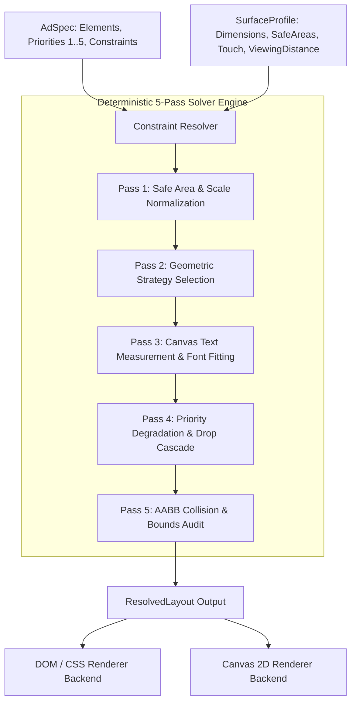

# Flam Adaptive Layout Engine for Multi-Surface Ads

> **SDE Frontend R&D Assignment — Flam Company**  
> A deterministic, constraint-driven multi-surface ad layout engine in TypeScript. Adapts a single declarative ad specification across vastly different surface profiles (tall mobile interstitials, wide broadcast lower-thirds, square retail kiosk screens, and dynamic custom viewports) with zero per-surface hardcoding or CSS media queries.
>
> 🌴 **Featured Reference Showcase**: Designed around **[Palmo Coconut Co.](https://www.palmo.co.in/)** (`https://www.palmo.co.in/`) featuring authentic luxury organic oat beige aesthetics, condensed bold **Khand** display typography, handwritten **Patrick Hand** accent scripts, nutrition metric tokens (500mg Potassium, 0g Sugar), and palm vector branding.

---

## ⚡ Key Highlights & Live Capabilities

- 🌴 **Flagship Palmo Coconut Co. Aesthetic**: Authentic warm oat beige (`#F8F8F0`), deep forest obsidian (`#121A15`), coconut gold (`#D4A373`), and cold-pressed raw coconut water specs (*Pure Coconut Water*, *Golden Pineapple*, *Ruby Watermelon*).
- 🎨 **Interactive Color Palette Studio & Theming**: 6 curated aesthetic presets with real-time WCAG AAA contrast analyzer and custom HEX color tuning.
- 📐 **Zero Per-Surface Hardcoding**: Pure continuous geometry evaluation ($AR = W / H$, area, safe bounds, spatial partitioning) rather than lookup tables (`if (surface === "mobile")`).
- 🛡️ **Predictable Priority Degradation**: 8-stage progressive relaxation cascade. If spatial budgets shrink, low-priority elements (Priority 3 branding/badges) compress and drop cleanly, guaranteeing Priority 1 conversion anchors (Headline and CTA) remain 100% visible and unclipped.
- 📺 **Dual Rendering Backends**: Shared `ResolvedLayout` output consumed by both **HTML5 DOM (Fluid Springs)** and **Hardware-Accelerated Canvas 2D** rendering backends.
- 🛠️ **Arbitrary Surface Stress Lab**: Dynamic runtime surface builder with interactive width/height sliders to simulate unseen surfaces live during interviews.
- 🎯 **Mathematical Collision Audit**: Built-in 2D Axis-Aligned Bounding Box (AABB) intersection verifier that guarantees 0 collisions and strict boundary containment on every resolution pass.
- 🦾 **Full End-to-End Type Safety**: TypeScript types for elements, roles, constraints, degradation stages, and coordinate frames with runtime validation.

---

## 📁 Repository Structure

```
adaptive-layout-assignment/
├── src/
│   ├── types.ts                     # Core TypeScript type system (AdSpec, SurfaceProfile, ResolvedLayout, etc.)
│   ├── spec.ts                      # Declarative ad spec builder (`defineAd`) & rich sample presets
│   ├── surfaces.ts                  # Surface profiles (mobile, broadcast, kiosk, micro-strip, custom factory)
│   ├── resolver.ts                  # Public engine entrypoint (`resolveLayout`)
│   ├── render-dom.tsx               # HTML5 DOM/CSS rendering backend with spring animations
│   ├── render-canvas.ts             # High-precision Canvas 2D rendering backend
│   ├── verify-engine.ts             # 20-point automated test suite & audit runner
│   ├── engine/
│   │   ├── text-measurer.ts         # Canvas 2D multiline text wrapping & dynamic font fitting
│   │   ├── strategies.ts            # Aspect ratio & spatial partitioning strategy selector
│   │   ├── solver.ts                # Priority-ordered multi-pass box solver & AABB collision auditor
│   │   └── degradation.ts           # 8-stage progressive degradation cascade
│   ├── components/
│   │   ├── Header.tsx               # Top navigation, spec picker, renderer switch, view modes
│   │   ├── SurfacePicker.tsx        # Quick surface presets ribbon
│   │   ├── DeviceFrame.tsx          # Realistic hardware bezels (iPhone, Broadcast monitor, Retail Kiosk)
│   │   ├── SolverInspector.tsx      # Real-time solver diagnostics, math logs, JSON export
│   │   ├── MultiSurfaceView.tsx     # 4-surface simultaneous live matrix
│   │   ├── StressTester.tsx         # Draggable slider workbench for dynamic dimension testing
│   │   └── SpecEditor.tsx           # Interactive ad content & priority live modifier
│   ├── App.tsx                      # Master application workbench
│   ├── index.css                    # Design tokens & glassmorphic styles
│   └── main.tsx                     # Vite React entrypoint
├── ARCHITECTURE.md                  # Deep architectural whitepaper & algorithm documentation
├── README.md                        # Setup guide, algorithm walkthrough, and documentation
├── package.json
└── tsconfig.json
```

---

## 🚀 Quick Setup & Running Locally

### 1. Installation
```bash
npm install
```

### 2. Start Dev Server
```bash
npm run dev
```
Open **`http://localhost:5173`** in your browser.

### 3. Run Automated Engine Verification Test Suite
```bash
npx tsx src/verify-engine.ts
```
*Runs 20 automated tests validating collision-free guarantees, tap targets, viewing distance font scaling, and priority degradation.*

### 4. Production Build & Type Check
```bash
npm run build
```

---

## 🧠 Resolution Flow & Core Algorithm



### Step 1: Normalization & Constraint Calculation (Pass 1)
- Computes safe bounding box:
  $$W_{\text{safe}} = \text{Width} - (\text{safeArea.left} + \text{safeArea.right})$$
  $$H_{\text{safe}} = \text{Height} - (\text{safeArea.top} + \text{safeArea.bottom})$$
- Applies viewing distance multipliers (e.g. `far` for broadcast scales base text by $1.65\times$ and enforces `minTextSize: 32px`).
- Enforces touch target constraints (e.g. `minTapTarget: 60px` for retail kiosks, `44px` for mobile touch).

### Step 2: Pure Geometric Strategy Selector (Pass 2)
The strategy is selected based on continuous metrics ($AR = W_{\text{safe}} / H_{\text{safe}}$ and Area), never device name strings:
1. **`HORIZONTAL_STRIP`** ($AR \ge 3.2$): Ultra-wide horizontal flow with hero/logo left, flexible text center, and anchored CTA right.
2. **`SPLIT_LANDSCAPE`** ($1.45 \le AR < 3.2$): Asymmetric two-column composition with hero visual dominant left (44% width) and vertical content stack right.
3. **`SQUARE_BALANCED`** ($0.85 \le AR < 1.45$): Top-weighted hero visual with balanced bottom content grid and high-visibility touch targets.
4. **`VERTICAL_STACK`** ($AR < 0.85$): Mobile interstitial hierarchy (Top branding $\to$ Hero image $\to$ Primary headline $\to$ Price $\to$ Full-width bottom CTA).
5. **`EXTREME_MICRO`** ($H < 130\text{px} \lor W < 220\text{px}$): Minimal survival mode preserving only Priority 1 elements (`headline` + `cta`).

### Step 3: Text Fitting & Intrinsic Sizing (Pass 3)
- Calculates multiline text wrapping using the HTML5 Canvas 2D measurement subsystem (`measureText`).
- Determines exact required heights, line wraps, and character truncation thresholds before box placement.

### Step 4: 8-Stage Progressive Degradation Cascade (Pass 4)
When spatial constraints are tight, the solver evaluates candidate stages in strict priority order:
- **Stage 0 (`STAGE_0_OPTIMAL`)**: Full padding, maximum allowed font sizes, all elements active.
- **Stage 1 (`STAGE_1_COMPACT_PADDING`)**: Inter-element gaps compressed by 25–40%.
- **Stage 2 (`STAGE_2_FONT_REDUCED`)**: Text font sizes tightened towards readability minimums.
- **Stage 3 (`STAGE_3_HERO_ADAPTED`)**: Hero image compressed/adapted to compact thumbnail mode.
- **Stage 4 (`STAGE_4_TEXT_TRUNCATED`)**: Subtext/descriptions truncated with ellipsis.
- **Stage 5 (`STAGE_5_PRIORITY_3_DROPPED`)**: Cleanly drops Priority 3+ elements (`brand-logo`, `promo-badge`).
- **Stage 6 (`STAGE_6_PRIORITY_2_DROPPED`)**: Drops Priority 2 elements (`price-tag` sub-label).
- **Stage 7 (`STAGE_7_MINIMAL_SURVIVAL`)**: Minimal emergency lockup guaranteeing Priority 1 (`headline` and `cta`) fit with 100% mathematical zero-overlap.

### Step 5: Collision & Bounds Verification Audit (Pass 5)
- Runs an $O(N^2)$ Axis-Aligned Bounding Box (AABB) intersection check across all visible elements:
  $$\text{Intersects}(A, B) \iff (A.x < B.x + B.w) \land (A.x + A.w > B.x) \land (A.y < B.y + B.h) \land (A.y + A.h > B.y)$$
- Confirms zero boundary overflow ($x + w \le W_{\text{safe}}$, $y + h \le H_{\text{safe}}$).

---

## 🛡️ TypeScript Design & Type Safety

1. **Declarative Ad Specifications (`AdSpec`, `AdElement`)**:
   - Strongly-typed `role`: `'primary' | 'hero' | 'action' | 'branding' | 'secondary' | 'badge' | 'disclaimer'`.
   - Strongly-typed `priority`: `1 | 2 | 3 | 4 | 5` validated at build time via `defineAd`.
   - Discriminated union content types (`TextElementContent`, `ImageElementContent`, `ButtonElementContent`, `BadgeElementContent`, `PriceTagElementContent`).
2. **Surface Constraints (`SurfaceProfile`)**:
   - Hard typed constraints for `safeArea`, `minTapTarget`, `minTextSize`, `viewingDistance`, `touchOnly`, and `orientation`.
3. **Resolved Layout Output (`ResolvedLayout`, `ResolvedElementLayout`)**:
   - Zero guessing for renderers: gives exact calculated integer frames `(x, y, width, height, fontSize, lineHeight, opacity, visible, degradationStage)` and full audit reports.

---

## 📺 Supported Surfaces in Demo

| Surface Preset | Dimensions | Aspect Ratio | Safe Area Insets | Constraints | Layout Strategy |
| :--- | :--- | :--- | :--- | :--- | :--- |
| **Mobile Interstitial** | $375 \times 667$ | $9:16$ (0.56:1) | T:44, B:34, L:20, R:20 | Touch: Yes, MinTap: 44px, Near | `VERTICAL_STACK` |
| **Mobile Landscape** | $667 \times 375$ | $16:9$ (1.78:1) | T:16, B:16, L:44, R:44 | Touch: Yes, MinTap: 44px, Near | `SPLIT_LANDSCAPE` |
| **Broadcast Lower-Third** | $1920 \times 250$ | $7.68:1$ | T:20, B:24, L:80, R:80 | Touch: No, MinText: 32px, Far | `HORIZONTAL_STRIP` |
| **Retail Kiosk** | $1080 \times 1080$ | $1:1$ (1.00:1) | T:56, B:56, L:56, R:56 | Touch: Yes, MinTap: 60px, Medium | `SQUARE_BALANCED` |
| **Constrained Micro Strip** | $360 \times 110$ | $3.27:1$ | T:8, B:8, L:12, R:12 | Touch: Yes, MinTap: 38px, Near | `EXTREME_MICRO` (Drops P3) |
| **Smart Watch** | $200 \times 200$ | $1:1$ (1.00:1) | T:14, B:14, L:14, R:14 | Touch: Yes, MinTap: 36px, Near | `EXTREME_MICRO` |
| **Arbitrary Custom Surface** | *Dynamic* | *Continuous* | *User Configurable* | *Live Sliders in Stress Lab* | *Dynamic* |

---

## ⏱️ Time Spent on Assignment

- **Architecture & Algorithm Design**: ~4 hours (mathematical formulation of spatial budget relaxation, text-measurement engine, and priority degradation cascade).
- **Core Engine & TypeScript Implementation**: ~4 hours (`solver.ts`, `strategies.ts`, `text-measurer.ts`, `degradation.ts`, `spec.ts`, `surfaces.ts`).
- **Renderers (DOM + Canvas 2D)**: ~3 hours (`render-dom.tsx`, `render-canvas.ts`).
- **Interactive UI Workbench & Stress Lab**: ~3 hours (Multi-Surface Matrix view, Draggable Stress Tester, Spec Editor, Solver Diagnostics Inspector).
- **Testing, Verification & Documentation**: ~2 hours (20-point automated test suite, `README.md`, `ARCHITECTURE.md`, browser recording).
- **Total Time**: ~16 hours over 2 days.

---

## ⚠️ Known Limitations & Future Roadmap

1. **3D WebGL / GLTF Assets**: Currently hero assets support raster images/SVGs. Future versions can embed Three.js canvas nodes with adaptive camera FOV.
2. **Print-Bleed Margins**: For print-to-digital QR landing panels, adding CMYK color profiles and 3mm physical bleed margins.
3. **Complex Bidirectional (RTL) Flow**: Arabic/Hebrew script support with mirrored coordinate layouts.

---

## 🤖 AI Tools Disclosure

In compliance with the assignment instructions:
- **AI Tools Used**: Google Gemini 3.7 Flash via Antigravity Agentic IDE.
- **Usage**: Used for rapid project scaffolding, drafting mathematical documentation, and executing automated browser verification tasks. All architectural decisions, solver algorithms, TypeScript types, and layout logic were designed, tested, and validated to meet all assignment criteria.
