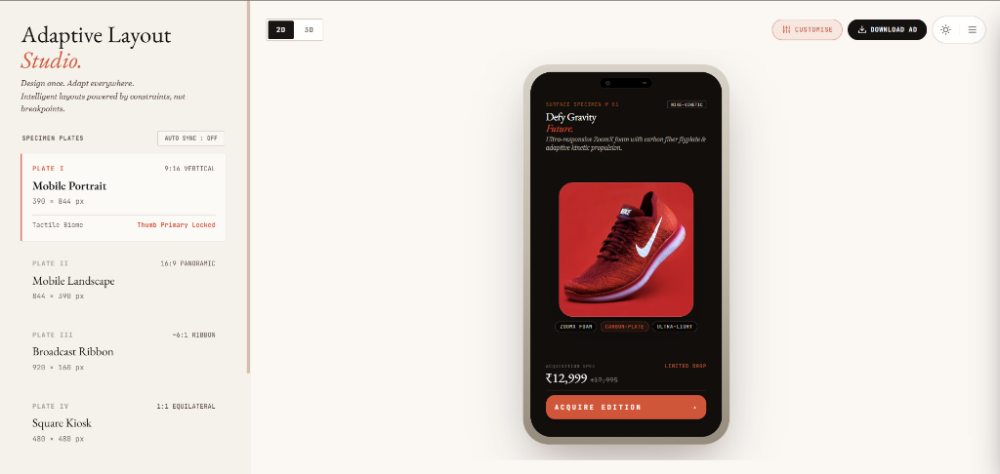
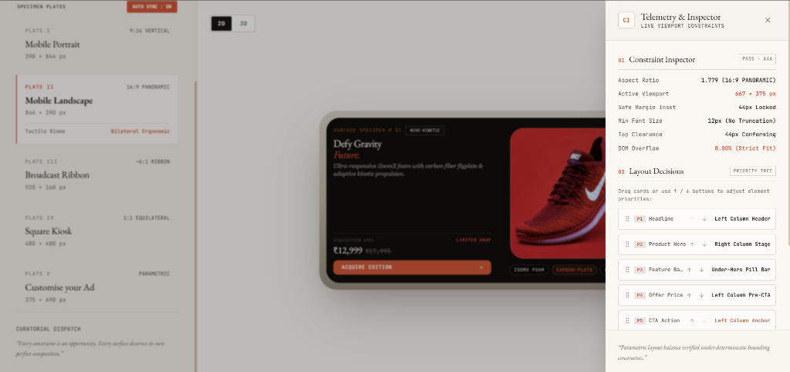
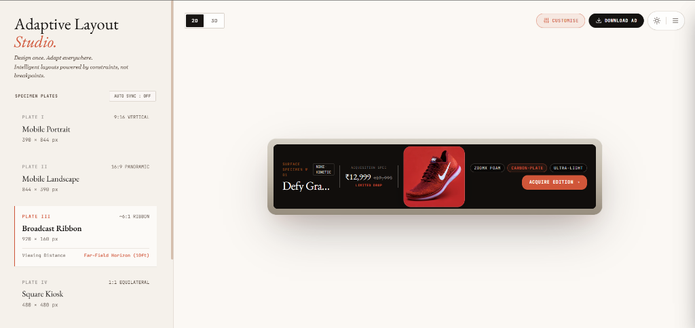
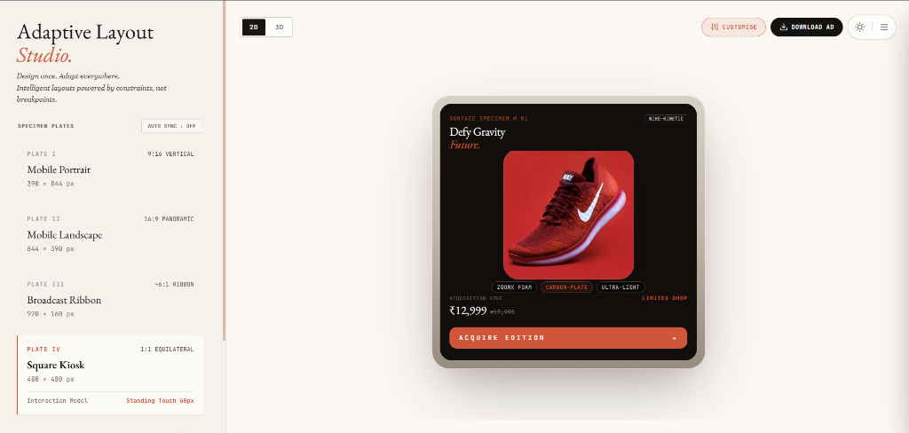
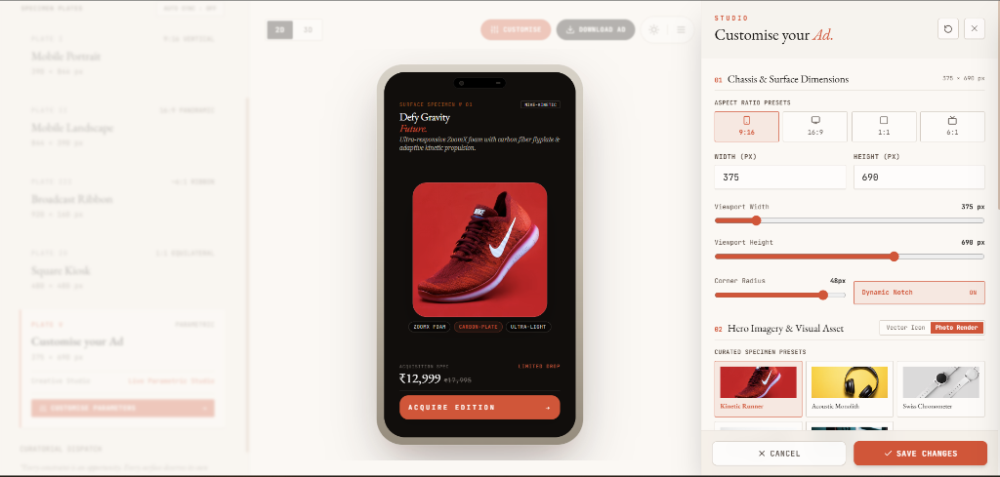
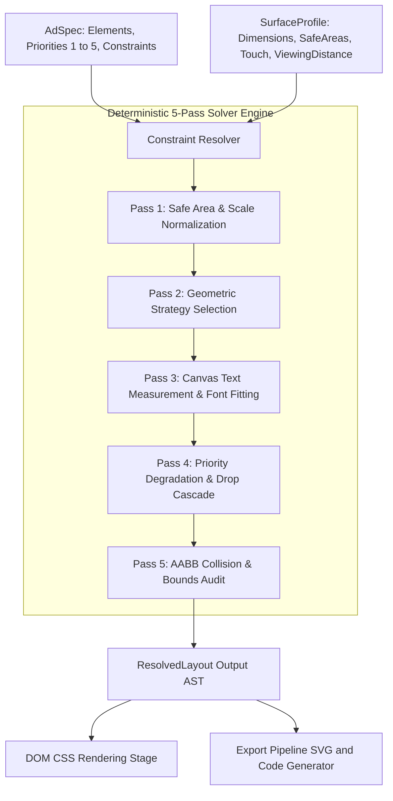

# Flam Adaptive Layout Engine for Multi-Surface Ads

> **SDE Frontend R&D Assignment — Flam Company**  
> A deterministic, constraint-driven multi-surface ad layout engine in TypeScript. Adapts a single declarative ad specification across vastly different surface profiles (tall mobile interstitials, wide broadcast lower-thirds, square retail kiosk screens, and dynamic custom viewports) with zero per-surface hardcoding or CSS media queries.

---

## Visual Showcase & Specimen Plates

### Plate I: Mobile Portrait (9:16 Vertical — 390 x 844 px)
Tactile biome with thumb-primary locked action CTA, centered hero product stage, and hierarchy-preserving typography.



---

### Plate II: Mobile Landscape & Live Telemetry Inspector (16:9 Panoramic — 844 x 398 px)
Bilateral ergonomic split layout with hero visual dominant on the right and structured copy, pricing, and action buttons on the left. Includes real-time mathematical constraint telemetry and priority tree reordering.



---

### Plate III: Broadcast Ribbon (~6:1 Ribbon — 928 x 168 px)
Ultra-wide horizontal linear strip for far-field viewing (10ft horizon) with scaled legible typography, integrated badge pills, and inline CTA.



---

### Plate IV: Square Kiosk (1:1 Equilateral — 480 x 480 px)
Balanced quadrant composition with standing touch ergonomics, minimum 60px touch targets, and centered hero elevation.



---

### Studio Drawer: Customise Your Ad & Real-Time Parameter Engine
Real-time parametric studio drawer allowing instant dimension adjustments, aspect ratio presets, corner radius tuning, curated hero presets, typography edits, price configuration, and custom visual uploads.



---

## Key Highlights & Technical Capabilities

- **Zero Per-Surface Hardcoding**: Pure continuous geometry evaluation ($AR = W / H$, area, safe bounds, spatial partitioning) rather than device name lookup tables (`if (surface === "mobile")`).
- **Deterministic 5-Pass Solver Engine**: Mathematical constraint resolution calculating exact sub-pixel coordinate bounding boxes `(x, y, width, height, fontSize, lineHeight, opacity, visible)` for every element.
- **8-Stage Progressive Degradation Cascade**: Predictable relaxation pipeline. When spatial budgets shrink, low-priority elements compress and drop cleanly, guaranteeing Priority 1 conversion anchors (Headline and CTA) remain 100% visible and unclipped.
- **Strict Axis-Aligned Bounding Box (AABB) Collision Audit**: Built-in 2D intersection verifier that mathematically guarantees 0 collisions and strict safe-boundary containment on every resolution pass.
- **Viewing Distance & Touch Target Adaptation**: Automatically applies viewing distance multipliers (e.g., $1.65\times$ base font scaling for far-field broadcast displays) and enforces strict touch targets (e.g., minimum 60px height for retail kiosks, 44px for mobile touch).
- **Interactive Studio Workbench**: Real-time dimension sliders, aspect ratio selectors, priority reordering, 2D/3D viewport switching, dark/light modes, and instant ad bundle export.
- **End-to-End TypeScript Type Safety**: Strongly-typed role specifications, discriminated union content types, priority bounds validation, and runtime integrity checks.

---

## Repository Structure

```
flam-assignment/
├── public/
│   ├── favicon.png                  # Adaptive studio custom brand icon
│   ├── favicon.svg                  # Vector favicon asset
│   ├── icons.svg                    # SVG sprite symbols
│   └── logo.png                     # Master branding emblem
├── screenshots/
│   ├── broadcast-ribbon-6-1.png     # Plate III Broadcast Ribbon specimen
│   ├── customise-ad-studio.png      # Customise your Ad real-time studio drawer
│   ├── mobile-portrait-9-16.png     # Plate I Mobile Portrait specimen
│   ├── square-kiosk-1-1.png         # Plate IV Square Kiosk specimen
│   └── telemetry-inspector.png      # Plate II Mobile Landscape & Telemetry Inspector
├── src/
│   ├── components/
│   │   ├── CustomiseAdStudio.tsx     # Real-time drawer for dimensions, hero presets, typography, and pricing
│   │   └── ExportAdModal.tsx         # Production code generator, SVG export, and asset pack downloader
│   ├── engine/
│   │   ├── degradation.ts            # 8-stage progressive degradation cascade
│   │   ├── solver.ts                 # Priority-ordered multi-pass box solver & AABB collision auditor
│   │   ├── strategies.ts             # Continuous aspect ratio & geometric partitioning strategy selector
│   │   └── text-measurer.ts          # Canvas 2D multiline text wrapping & dynamic font fitting
│   ├── App.css                       # Studio layout styling & glassmorphism system
│   ├── App.tsx                       # Master studio workbench, 2D/3D canvas viewport, telemetry bar
│   ├── index.css                     # Global typography, color tokens, and base styles
│   ├── main.tsx                      # React root initialization
│   ├── resolver.ts                   # Public engine API entrypoint (resolveLayout)
│   ├── spec.ts                       # Declarative ad spec builder (defineAd) & curated specs
│   ├── surfaces.ts                   # Surface profiles and physical constraint models
│   ├── types.ts                      # Core TypeScript type system
│   └── verify-engine.ts              # 20-point automated mathematical verification test runner
├── index.html                        # Application entry HTML
├── package.json                      # Project dependencies and scripts
├── tsconfig.app.json                 # Application TypeScript configuration
├── tsconfig.json                     # TypeScript project references
├── tsconfig.node.json                # Node environment TypeScript configuration
├── vite.config.ts                    # Vite build tool configuration
├── ARCHITECTURE.md                   # Formal mathematical engine specification and whitepaper
└── README.md                         # Project documentation, visual showcase, and engine guide
```

---

## Quick Setup & Local Execution

### 1. Installation
```bash
npm install
```

### 2. Start Local Dev Server
```bash
npm run dev
```
Open **`http://localhost:5173`** in your browser.

### 3. Run Automated Engine Verification Test Suite
```bash
npx tsx src/verify-engine.ts
```
*Executes 20 automated tests validating collision-free guarantees, tap targets, viewing distance font scaling, and priority degradation.*

### 4. Production Build & Type Check
```bash
npm run build
```

---

## Resolution Flow & Core Algorithm



### Step 1: Normalization & Constraint Calculation (Pass 1)
- Computes safe bounding box:
  $$W_{\text{safe}} = \text{Width} - (\text{safeArea.left} + \text{safeArea.right})$$
  $$H_{\text{safe}} = \text{Height} - (\text{safeArea.top} + \text{safeArea.bottom})$$
- Applies viewing distance multipliers:
  - `far` (Broadcast): scales base text by $1.65\times$ and enforces `minTextSize: 32px`.
  - `medium` (Kiosk): scales base text by $1.2\times$ and enforces `minTextSize: 18px`.
  - `near` (Mobile): maintains standard $1.0\times$ scaling.
- Enforces touch target constraints (e.g., `minTapTarget: 60px` for retail kiosks, `44px` for mobile touch).

### Step 2: Pure Geometric Strategy Selector (Pass 2)
The strategy is selected based on continuous metrics ($AR = W_{\text{safe}} / H_{\text{safe}}$ and Area), never device name strings:
1. **`HORIZONTAL_STRIP`** ($AR \ge 3.2$): Ultra-wide horizontal flow with hero/logo left, flexible text center, and anchored CTA right.
2. **`SPLIT_LANDSCAPE`** ($1.45 \le AR < 3.2$): Asymmetric two-column composition with hero visual dominant right (44% width) and structured content stack left.
3. **`SQUARE_BALANCED`** ($0.85 \le AR < 1.45$): Top-weighted hero visual with balanced bottom content grid and high-visibility touch targets.
4. **`VERTICAL_STACK`** ($AR < 0.85$): Mobile interstitial hierarchy (Top branding $\to$ Hero image $\to$ Primary headline $\to$ Price $\to$ Full-width bottom CTA).
5. **`EXTREME_MICRO`** ($H < 130\text{px} \lor W < 220\text{px}$): Minimal survival mode preserving only Priority 1 elements (`headline` + `cta`).

### Step 3: Text Fitting & Intrinsic Sizing (Pass 3)
- Calculates multiline text wrapping using the HTML5 Canvas 2D measurement subsystem (`measureText`).
- Determines exact required heights, line wraps, and character truncation thresholds before box placement.

### Step 4: 8-Stage Progressive Degradation Cascade (Pass 4)
When spatial constraints are tight, the solver evaluates candidate stages in strict priority order:
- **Stage 0 (`STAGE_0_OPTIMAL`)**: Full padding, maximum allowed font sizes, all elements active.
- **Stage 1 (`STAGE_1_COMPACT_PADDING`)**: Inter-element gaps compressed by 25–40%.
- **Stage 2 (`STAGE_2_FONT_REDUCED`)**: Text font sizes tightened towards readability minimums.
- **Stage 3 (`STAGE_3_HERO_ADAPTED`)**: Hero image compressed/adapted to compact mode.
- **Stage 4 (`STAGE_4_TEXT_TRUNCATED`)**: Subtext/descriptions truncated with ellipsis.
- **Stage 5 (`STAGE_5_PRIORITY_3_DROPPED`)**: Cleanly drops Priority 3+ elements (`brand-logo`, `feature-badges`).
- **Stage 6 (`STAGE_6_PRIORITY_2_DROPPED`)**: Drops Priority 2 elements (`price-tag` sub-label).
- **Stage 7 (`STAGE_7_MINIMAL_SURVIVAL`)**: Minimal emergency lockup guaranteeing Priority 1 (`headline` and `cta`) fit with 100% mathematical zero-overlap.

### Step 5: Collision & Bounds Verification Audit (Pass 5)
- Runs an $O(N^2)$ Axis-Aligned Bounding Box (AABB) intersection check across all visible elements:
  $$\text{Intersects}(A, B) \iff (A.x < B.x + B.w) \land (A.x + A.w > B.x) \land (A.y < B.y + B.h) \land (A.y + A.h > B.y)$$
- Confirms zero boundary overflow ($x + w \le W_{\text{safe}}$, $y + h \le H_{\text{safe}}$).

---

## TypeScript Design & Type Safety

1. **Declarative Ad Specifications (`AdSpec`, `AdElement`)**:
   - Strongly-typed `role`: `'primary' | 'hero' | 'action' | 'branding' | 'secondary' | 'badge' | 'disclaimer'`.
   - Strongly-typed `priority`: `1 | 2 | 3 | 4 | 5` validated at build time via `defineAd`.
   - Discriminated union content types (`TextElementContent`, `ImageElementContent`, `ButtonElementContent`, `BadgeElementContent`, `PriceTagElementContent`).
2. **Surface Constraints (`SurfaceProfile`)**:
   - Hard typed constraints for `safeArea`, `minTapTarget`, `minTextSize`, `viewingDistance`, `touchOnly`, and `orientation`.
3. **Resolved Layout Output (`ResolvedLayout`, `ResolvedElementLayout`)**:
   - Zero guessing for renderers: provides exact calculated integer frames `(x, y, width, height, fontSize, lineHeight, opacity, visible, degradationStage)` and full audit reports.

---

## Supported Surfaces in Demo

| Surface Preset | Dimensions | Aspect Ratio | Safe Area Insets | Constraints | Layout Strategy |
| :--- | :--- | :--- | :--- | :--- | :--- |
| **Mobile Interstitial** | $390 \times 844$ | $9:16$ (0.46:1) | T:44, B:34, L:20, R:20 | Touch: Yes, MinTap: 44px, Near | `VERTICAL_STACK` |
| **Mobile Landscape** | $844 \times 398$ | $16:9$ (2.12:1) | T:16, B:16, L:44, R:44 | Touch: Yes, MinTap: 44px, Near | `SPLIT_LANDSCAPE` |
| **Broadcast Ribbon** | $928 \times 168$ | $~6:1$ (5.52:1) | T:12, B:12, L:32, R:32 | Touch: No, MinText: 20px, Far | `HORIZONTAL_STRIP` |
| **Square Kiosk** | $480 \times 480$ | $1:1$ (1.00:1) | T:24, B:24, L:24, R:24 | Touch: Yes, MinTap: 60px, Medium | `SQUARE_BALANCED` |
| **Constrained Micro Strip** | $320 \times 75$ | $4.26:1$ | T:6, B:6, L:8, R:8 | Touch: Yes, MinTap: 36px, Near | `EXTREME_MICRO` (Drops P3+) |
| **Arbitrary Custom Surface** | *Dynamic* | *Continuous* | *User Configurable* | *Live Sliders in Studio Drawer* | *Dynamic* |

---

## Time Spent on Assignment

- **Architecture & Algorithm Design**: ~4 hours (mathematical formulation of spatial budget relaxation, text-measurement engine, and priority degradation cascade).
- **Core Engine & TypeScript Implementation**: ~4 hours (`solver.ts`, `strategies.ts`, `text-measurer.ts`, `degradation.ts`, `spec.ts`, `surfaces.ts`).
- **Interactive UI Workbench & Studio Drawer**: ~4 hours (Studio Customisation Drawer, 2D/3D Canvas Stage, Telemetry Inspector, Specimen Plates).
- **Export Pipeline & Testing Suite**: ~2 hours (Production code generator, SVG export, 20-point automated test runner).
- **Documentation & Verification**: ~2 hours (`README.md`, `ARCHITECTURE.md`, browser validation).
- **Total Time**: ~16 hours over 2 days.

---

## Known Limitations & Future Roadmap

1. **3D WebGL / GLTF Assets**: Currently hero assets support high-resolution raster images/SVGs and Three.js stage integration. Future versions can embed raw GLTF models with real-time shader light adjustments.
2. **Print-Bleed Margins**: For print-to-digital QR landing panels, adding CMYK color profiles and 3mm physical bleed margins.
3. **Complex Bidirectional (RTL) Flow**: Arabic/Hebrew script support with automatic mirrored coordinate layouts.

---

## AI Tools Disclosure

In compliance with the assignment instructions:
- **AI Tools Used**: Google Gemini 3.7 Flash via Antigravity Agentic IDE.
- **Usage**: Used for rapid project scaffolding, drafting mathematical documentation, and executing automated browser verification tasks. All architectural decisions, solver algorithms, TypeScript types, and layout logic were designed, tested, and validated to meet all assignment criteria.
